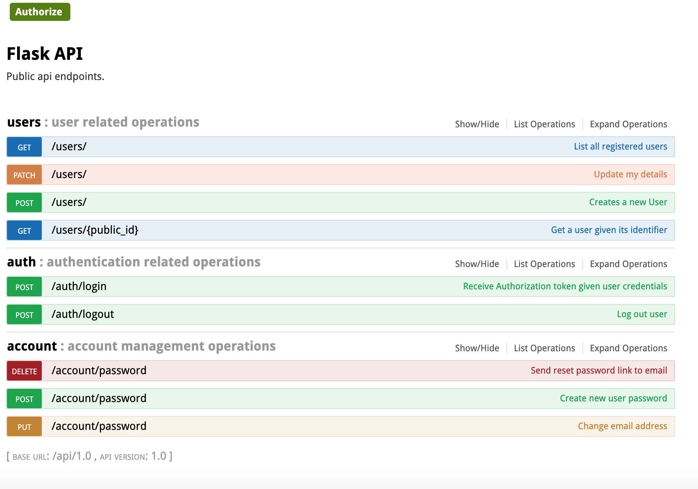

# Flask REST api boilerplate

## What's included
- swagger UI
- rate limiter
- dotenv configs
- users endpoint
- auth endpoint using JWT
- forgot password endpoints (no email sending - just get secret token from db for testing)

## Installation

Clone the repo and run:
`pip install requirements.txt`

## Launching

To run application you need to have redis installed as it is needed for rate limiter.
Install all other missing packages on your machine and then run:
`make run`
The swagger will be accessible at http://127.0.0.1:5000/api/1.0/

## About

The base is created from tutorial here:
https://medium.freecodecamp.org/structuring-a-flask-restplus-web-service-for-production-builds-c2ec676de563
Thanks to @cosmic-byte

The rate limiter is a modified version of this code:
https://wakatime.com/blog/34-flask-part-3-api-decorators-and-helpers
Thanks to @alanhamlett
